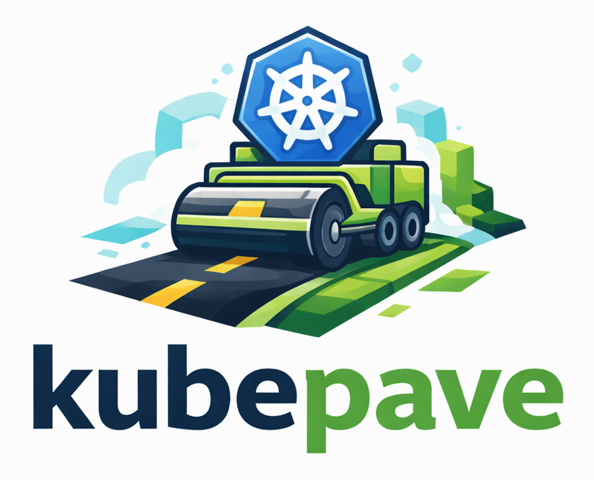

<p align="center" width="100%">
    
</p>
<p align="center" >
  A micro Internal Developer Platform for local Kubernetes.
</p>
<p align="center" >
  
  
  
  
  
</p>

# 📘 How-to
Everything needed to bootstrap this Micro IDP is automated with **Task**.

If you don't have Task installed, follow [this guide](https://taskfile.dev/docs/installation).

---

## Why Task

Mostly curiosity 🙂 — but it turned out to be a great fit.
Task lets you define:
- which scripts run
- in what order
- with which variables
All in a clean and readable way — nothing fancy.

Compared to a Makefile, Task feels simpler and more human-friendly.

The only downside is that you need to install the Task binary first.  
But there’s no perfect tool for everyone — and this is no exception.

## Where does it run?

It started with Minikube for local development.
Later it grew to support other environments too (Kind, maybe AWS/GCP in the future).

For local setup, plain **shell scripts** work best — they run everywhere without extra dependencies.

So the repo just uses a few small scripts to:
- start clusters
- install components
- wire everything together

Nothing fancy. Just enough to get you up and running quickly.

In the future, additional approaches may be added for cloud environments.


## Minikube Driver
### Why KVM instead of Docker?

The Docker driver isolates each Minikube profile in separate bridge networks, which breaks direct cluster-to-cluster routing and requires networking workarounds.
Using the KVM (kvm2) driver runs each profile as a VM on a shared network, enabling native L3 routing and predictable multi-cluster behavior — closer to real infrastructure.

👉 [KVM installation guide](https://help.ubuntu.com/community/KVM/Installation)

## 🚀 Getting started

Check dependencies:

```bash
task --dir minikube check
```

Start clusters only:

```bash
task --dir minikube start
```

Bootstrap everything:

```bash
task --dir minikube up
```

Load the Argo CD admin password and Vault token into your shell:

```bash
source .platform-creds.env
```

Prefer not to print secrets? Copy them directly to your clipboard:

```bash
printf %s "$VAULT_ROOT_TOKEN" | xclip -selection clipboard
printf %s "$ARGOCD_ADMIN_PASSWORD" | xclip -selection clipboard
```

## 🧹 Destroy everything

```bash
task --dir minikube down
```

# 📚 Further details

## Argo CD
All Argo CD resources live in `argocd-applications/`.

## Minikube
In the `minikube` directory you will find everything you need to spin up the clusters using Minikube.

## Helm charts
All Helm charts live under the `charts/` directory.

We depend on the official upstream Helm charts and compose them as dependencies.  
Tenant-specific provisioning charts are located in `charts/tenants`.

Made with ❤️ and ✨.
