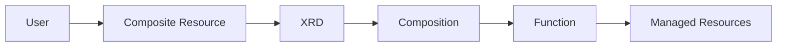
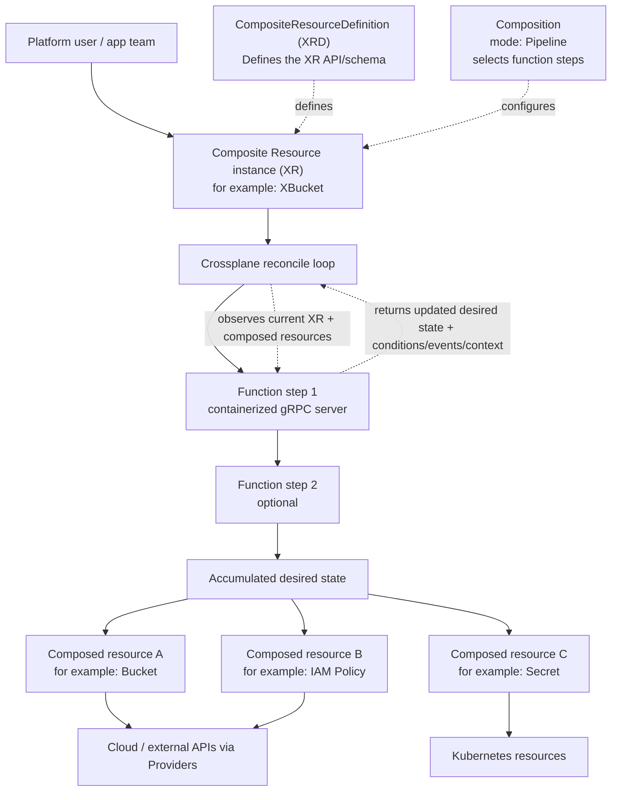

# How Crossplane Components Work Together

## Crossplane mental model

**Think of Crossplane like this**

You want to offer a platform API like:

> “Give me a database”

But under the hood, that database may require several real resources:
- a cloud database instance
- a network rule
- a secret
- maybe monitoring or IAM too

Crossplane lets you hide that complexity behind one custom object.

Look at the diagram below:



In plain English:

### XRD

Defines the API users are allowed to create.
It says:
- what the new resource is called
- what fields it has
- what the schema looks like

So an XRD is basically:

“I am creating a new Kubernetes resource type called something like `XDatabase`.”


### XR 
One actual instance of that API.

If the XRD defines `foo`, then an XR is a real object like:
- `foo`
- region: `us-east-1`
- size: `small`

So:
- XRD = the definition of the type
- XR = one object of that type

### Composition
The blueprint for how to turn that XR into real resources.

It tells Crossplane:

“When someone creates a `foo`, build these underlying resources.”
```
kind: XDatabase
name: foo
```

So the Composition is the assembly plan. It connects the custom API to the actual managed resources Crossplane should create.

### Function

The logic inside the blueprint.

In modern Crossplane, a Composition can be a pipeline of Functions. Crossplane calls those Functions to decide what resources should be created or updated for the XR. Functions run as pods, and Crossplane talks to them over gRPC.

So the Function is the part that says things like:
- “Create an RDS instance”
- “Also create a security group”
- “Set the region from the XR spec”
- “If this option is enabled, create one more resource”


Simply put:
```
XRD = define a new API
XR = a user's request using that API
Composition = blueprint for fulfilling it
Function = logic that builds the blueprint output
```
Here’s a detailed view of how Crossplane turns an XR into composed resources using a Composition and Functions:


# Crossplane Tenant Function Overview

## 1. The Big Picture

`function-tenant` provisions **three resources in sequence**:

``` text
XR: Tenant
 │
 ├── AzureAD Group
 │
 ├── ArgoCD Application (gitops-tenant)
 │
 └── ArgoCD Application (baseline-tenant)
```

The function enforces the following dependency chain:

``` text
Entra Group must exist → before GitOps/Baseline are created
```

In practice this means:

1.  Create the **Azure AD / Entra group**
2.  Wait until the group exists and has an `objectId`
3.  Use that information to create the **ArgoCD applications**

------------------------------------------------------------------------

# 2. The Reconciliation Loop (Most Important Concept)

`function-tenant` **does not run only once**.\
It runs **every time Crossplane reconciles the XR**.

You can think of reconciliation as Crossplane repeatedly asking:

> "What should the desired state of the world be right now?"

A typical lifecycle looks like this:

``` text
User creates Tenant
     │
     ▼
Function Run #1
     │
     ├─ creates AzureAD group
     └─ exits (waiting)
     
Azure provider reconciles group
     │
     ▼
Function Run #2
     │
     ├─ group exists → get objectId
     ├─ create ArgoCD apps
     └─ exit

ArgoCD reconciles apps
     │
     ▼
Function Run #3
     │
     └─ everything healthy → mark Ready
```

### Key takeaway

**Functions are not one-shot scripts.\
They are part of Crossplane's reconciliation loop.**

------------------------------------------------------------------------

# 3. Function Initialization

A Crossplane Function is actually a **small gRPC server running inside a
container**.

When you install your function:

1.  Crossplane creates a **pod**
2.  Your **Go program runs inside that pod**
3.  Crossplane communicates with it using **gRPC**

Architecture overview:

``` text
Kubernetes
   │
   │  Crossplane Controller
   │
   ▼
calls gRPC
   │
   ▼
Function Pod (your code)
   │
   ▼
RunFunction()
```

Your Go program is essentially **a server waiting for Crossplane to call
it**.

Crossplane invokes the function like this:

``` text
RunFunction(request) -> response
```

------------------------------------------------------------------------

# 4. The Function Struct

This struct implements the **Crossplane Function gRPC server**:

``` go
type Function struct {
    fnv1.UnimplementedFunctionRunnerServiceServer
    log logging.Logger
}
```

Every time reconciliation happens, Crossplane calls:

``` text
RunFunction()
```

------------------------------------------------------------------------

# 5. What This Line Actually Means

``` go
fnv1.UnimplementedFunctionRunnerServiceServer
```

This is a **helper struct generated by protobuf**.\
It provides **default implementations for the gRPC service**.

It essentially means:

> "This struct implements the gRPC interface that Crossplane expects."

------------------------------------------------------------------------

# 6. What the Interface Looks Like

The gRPC interface roughly looks like this:

``` go
type FunctionRunnerServiceServer interface {
    RunFunction(context.Context, *RunFunctionRequest) (*RunFunctionResponse, error)
}
```

Your struct must implement this method:

``` go
func (f *Function) RunFunction(...)
```

Embedding:

``` go
fnv1.UnimplementedFunctionRunnerServiceServer
```

ensures your struct **satisfies the interface**.

------------------------------------------------------------------------

# 7. The Real Flow

When a `Tenant` XR changes:

``` text
User creates Tenant
```

Example:

``` yaml
apiVersion: platform.io/v1
kind: Tenant
```

Crossplane starts reconciliation.

The flow then becomes:

``` text
Crossplane Controller
     │
     ▼
calls function
     │
     ▼
RunFunction(request)
     │
     ▼
Your code executes
```

------------------------------------------------------------------------

# 8. The Simplest Possible Crossplane Function

Here is the **minimal possible function implementation**:

``` go
type Function struct {
    fnv1.UnimplementedFunctionRunnerServiceServer
}

func (f *Function) RunFunction(
    ctx context.Context,
    req *fnv1.RunFunctionRequest,
) (*fnv1.RunFunctionResponse, error) {

    fmt.Println("Crossplane called me!")

    return &fnv1.RunFunctionResponse{}, nil
}
```

That's it.

Everything else in your implementation is simply **platform logic
layered on top of this entry point**.
